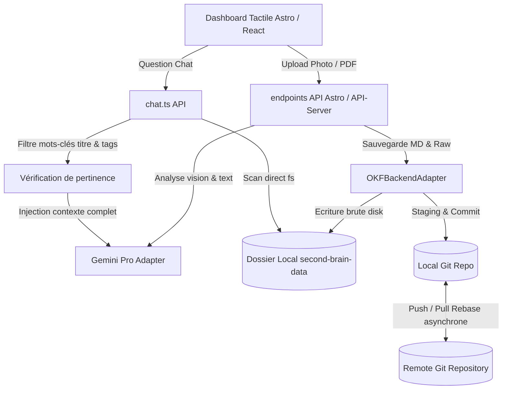

# Second Brain Copilot

Un second cerveau numérique **local-first** et orienté **mobile/tablette**, propulsé par Astro, Quatrain et Gemini. Il gère vos notes, images, photos et documents au format standardisé **OKF** (Open Knowledge Format), sauvegardé sur Git.

---

## 🧭 Principes Fondamentaux

### 1. Local-First par Défaut
* Le **système de fichiers local** est l'unique source de vérité en lecture et en recherche. 
* L'application interroge directement le disque (bypassant le cache d'indexation Git) pour assurer que les modifications, ajouts manuels ou renommages sont visibles en temps réel par l'application et par le LLM.

### 2. Standardisation OKF (Open Knowledge Format)
Chaque note ou document importé est stocké sous forme de fichier Markdown propre contenant :
* **Un en-tête YAML plat :** Des métadonnées claires (titre, résumé, catégorie hiérarchique, tags, date de création). Aucun champ vide ou nul (`null` / `""`) n'est écrit.
* **Un type de concept sémantique :** Le champ `type` qualifie la nature fonctionnelle du document (ex: `specification`, `guide`, `screenshot`, `invoice`, `recipe`, `note`), pas son architecture de données.
* **Le corps du document :** Le contenu complet textuel ou transcrit.
* **Le nommage sémantique :** Les fichiers et dossiers sont nommés selon leur titre (slugifié) plutôt que par des UUIDs obscurs (ex: `/content/technology/ai/okf-spec.md`).

### 3. Divulgation Progressive (Progressive Disclosure)
* Chaque dossier thématique contient un fichier `index.md` auto-généré listant ses sous-catégories et ses concepts associés.
* Les agents d'IA peuvent ainsi explorer la base de connaissances pas à pas en suivant les liens Markdown, sans saturer leur fenêtre de contexte.

### 4. Git as a Transport Layer
* Git est utilisé de manière asynchrone uniquement pour la persistance, l'historisation des versions et la synchronisation avec des dépôts distants (GitHub/GitLab).

---

## 🏗️ Architecture Technique



### Dossiers Clés
* `/src/pages/api/upload.ts` : Endpoint gérant l'upload de PDF/images, l'appel Gemini structuré, la génération de slug sémantique et la persistance.
* `/src/pages/api/chat.ts` : Endpoint de discussion contextuelle avec filtrage intelligent par mots-clés de titres et tags.
* `/src/pages/api/initialize.ts` : Initialiseur d'onboarding utilisateur créant les répertoires et les documents de bienvenue.
* `packages/okf/src/OKFBackendAdapter.ts` (dans le monorepo Quatrain/Core) : L'adaptateur de base de données OKF assurant la sérialisation plate sans champs vides et la génération récursive automatique des fichiers `index.md`.

---

## 🚀 Démarrage Rapide

### Prérequis
* [Bun](https://bun.sh) ou [Yarn](https://yarnpkg.com) installé.
* Une clé d'API Google AI Studio (Gemini).

### Configuration (`.env`)
Créez un fichier `.env` à la racine :
```env
GEMINI_API_KEY=votre_cle_gemini
GEMINI_MODEL=gemini-2.5-flash
GIT_MODE=local
GIT_LOCAL_PATH=/chemin/absolu/vers/second-brain-data
DOCUMENT_STORAGE_PATH=/chemin/absolu/vers/second-brain-documents
```

### Installation et Lancement
```bash
# Installer les dépendances
yarn install

# Lancer en mode développement
yarn run dev
```
L'application est accessible à l'adresse `http://localhost:4321`.
