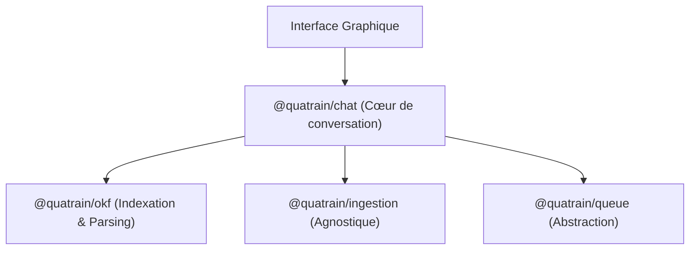

# Spécification Technique - Priorité 1 : Cœur et Exécution Locale

Cette première étape vise à consolider la version mono-utilisateur de **Modaka** en séparant proprement la logique métier des adaptateurs de bas niveau, et en permettant une exécution locale maximale sur mobile.

---

## 1. Découpage du Cœur : `@quatrain/chat` & `@quatrain/okf`

Pour garantir la flexibilité du système, le cœur logique est divisé en packages monorepo indépendants de l'interface graphique :



### A. `@quatrain/okf` (Déjà existant dans le dépôt Core)
* **Rôle** : Format d'échange et de stockage plat.
* **Fonctions clés** :
  * Validation stricte des métadonnées (types, tags, timestamps).
  * Génération récursive des index de navigation (`index.md`).
  * Transformation bidirectionnelle (Markdown avec Frontmatter <-> Objet JS JSON).

### B. `@quatrain/chat` (Nouveau package Core - Logique Pure / Headless)
* **Rôle** : Logique métier non-graphique de discussion (moteur conversationnel, recherche hybride textuelle et sémantique, historique des messages, orchestration des invites/prompts et liaison avec les modèles de langage).
* **Environnement** : Conçu pour tourner de manière agnostique sur n'importe quel runtime JS (Node, Bun, ou dans le thread principal d'un moteur mobile sous Expo).
* **Découplage Vue/Logique (Core vs CoreUX)** :
  * **Dans `@quatrain/chat` (Core)** : Uniquement le contrôleur logique et les machines d'états de conversation (`ChatController`, `MessageHistory`), sans aucune dépendance UI (pas de HTML, pas de React, pas de CSS).
  * **Dans `CoreUX` (Interface Graphique)** : Tous les composants d'interface utilisateur en contact direct avec l'utilisateur (la bulle de discussion, le champ de saisie, le bouton du microphone, le lecteur vocal, et les dalles tactiles). Ces composants de `CoreUX` s'abonnent et interagissent avec les contrôleurs logiques de `@quatrain/chat`.

---

## 2. Ingestion Modulaire : `@quatrain/ingestion`

Plutôt que d'intégrer les convertisseurs et processeurs de fichiers au cœur de l'application, nous structurons un namespace agnostique d'adaptateurs :

```
@quatrain/ingestion
├── @quatrain/ingestion-ocr    # Extraction d'images et PDF scannés
├── @quatrain/ingestion-audio  # Transcription de mémos vocaux
├── @quatrain/ingestion-video  # Parsing de vidéos ou URL YouTube
└── @quatrain/ingestion-web    # Nettoyage et crawl de pages HTML
```

### Exécution local-first vs Cloud :
Chaque adaptateur implémente le pattern port/adapter :
* En **local (sur mobile)**, l'OCR s'appuie sur le SDK natif de l'appareil (iOS Vision / Android ML Kit).
* En **mode cloud (SaaS)**, l'adaptateur redirige le flux vers un service API dédié (Google Vision API, etc.).

---

## 3. Queue et Traitement Local : `@quatrain/queue`
* Les tâches d'ingestion (OCR, transcription, indexation) transitent par une file d'attente.
* Pour l'auto-hébergement et la version mobile locale, le système utilise l'adaptateur de file d'attente locale stocké dans la base SQLite locale de l'application.

---

## 4. `modaka-app` (Wrapper Mobile Expo)

L'application est distribuée sous forme d'application native iOS et Android via **Expo**.

### Pourquoi Expo / React Native ?
Pour répondre au besoin d'exécution **On-Device** (sur le téléphone) :
* **Stockage Fichier** : Utilisation de `expo-file-system` pour enregistrer l'arborescence OKF directement dans l'espace de stockage sécurisé du téléphone.
* **OCR et Audio** : Accès direct aux processeurs locaux du téléphone pour transcrire la voix (Whisper local) et exécuter l'OCR sur les photos prises.
* **SLM Locaux (GPU)** : Exploitation de l'accélération matérielle mobile (via *ONNX Runtime Mobile* ou *llama.rn*) pour faire tourner des modèles de langage légers (ex: Gemini Nano, Phi-3) directement hors ligne.

### Exécution d'Astro dans Expo (Analyse Technique)
* **Le Frontend (Astro UI)** : exporté statiquement (`output: 'export'`) et hébergé localement dans un composant `react-native-webview`.
* **Le Backend (Pas de serveur HTTP)** : Pas de serveur Node tournant en tâche de fond sur l'appareil (anti-pattern consommant trop de batterie et tué par l'OS). Les appels de l'interface vers les API sont interceptés et mappés directement sur des appels de fonctions JavaScript de la bibliothèque `modaka` locale.
