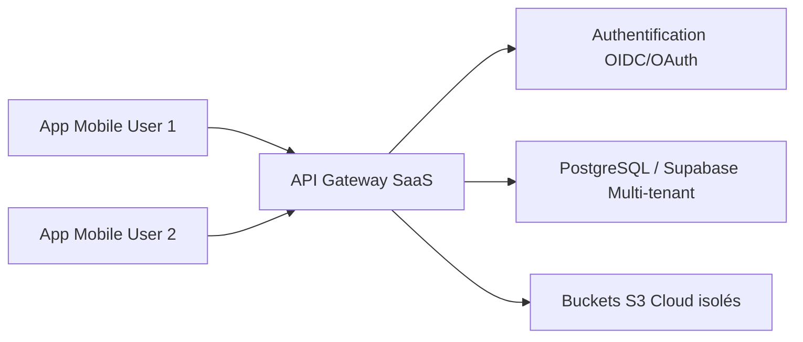

# Spécification Technique - Priorité 2 : SaaS & Curation

Cette étape introduit la colocation multi-tenant (SaaS), la gestion distribuée des tâches de traitement et l'alimentation sémantique via la curation collaborative.

---

## 1. `modaka-saas` (Multi-Locataires Cloud)

La version SaaS est construite sur le même cœur `modaka` mais encapsule l'application dans un contexte multi-locataires hébergé dans le Cloud.



### A. Authentification Pluggable
* Intégration de modules d'authentification standardisés (OpenID Connect, Next-Auth ou Supabase Auth).
* Permet aux utilisateurs de se connecter soit via le compte central Modaka, soit via leurs propres comptes d'entreprise.

### B. Double Mode de Stockage (Hybride / Cloud)
* **Mode Cloud Managé** : Les données OKF et fichiers binaires (PDF, Audio, Image) sont sauvegardés sur les serveurs sécurisés de Modaka (PostgreSQL + Buckets S3 gérés par tenant).
* **Mode BYOS (Bring Your Own Storage)** : L'infrastructure SaaS sert d'interface logicielle mais se connecte directement aux dépôts Git et buckets S3 privés de l'utilisateur (renseignés dans son profil), garantissant la souveraineté de ses données.

---

## 2. Ingestion Curation : `bookworm`

Pour éviter le problème de la base vide au démarrage (cold start), le SaaS Modaka intègre une source de connaissances pré-curée via l'application **Bookworm**.

```
  [ Bookworm (Curation) ]
           │ (Export OKF)
           ▼
[ Flux de Veille Agronomie ]
           │ (Abonnement sémantique)
           ▼
 [ Hey Brad / Modaka SaaS ]
```

* **Rôle** : `bookworm` est une plateforme collaborative web permettant à des experts de structurer des référentiels de connaissances (ex: l'agronomie mondiale, guides de culture, diagnostics de maladies de plantes).
* **Format** : Toutes les curations de Bookworm sont stockées et exportées selon la spécification standard **OKF v0.1**.
* **Intégration** : L'utilisateur de Modaka/Hey Brad s'abonne à des flux de curation thématiques. L'application télécharge et indexe automatiquement ces arbres OKF dans le Second Brain de l'utilisateur.

---

## 3. Files d'Attente Distribuées : `@quatrain/queue`

Dans l'environnement SaaS, le traitement de l'ingestion (transcription, analyse de gros volumes) est découplé sur des serveurs de traitement (Workers).
* L'architecture s'appuie sur les adaptateurs distants du namespace `@quatrain/queue` :
  * **`@quatrain/queue-aws`** : Utilisation d'Amazon SQS pour les environnements AWS.
  * **`@quatrain/queue-amqp`** : Utilisation de RabbitMQ / AMQP pour les architectures conteneurisées basées sur Podman/Docker.
* Cela permet de gérer de fortes variations de charge sans impacter la réactivité du frontend mobile ou web.
