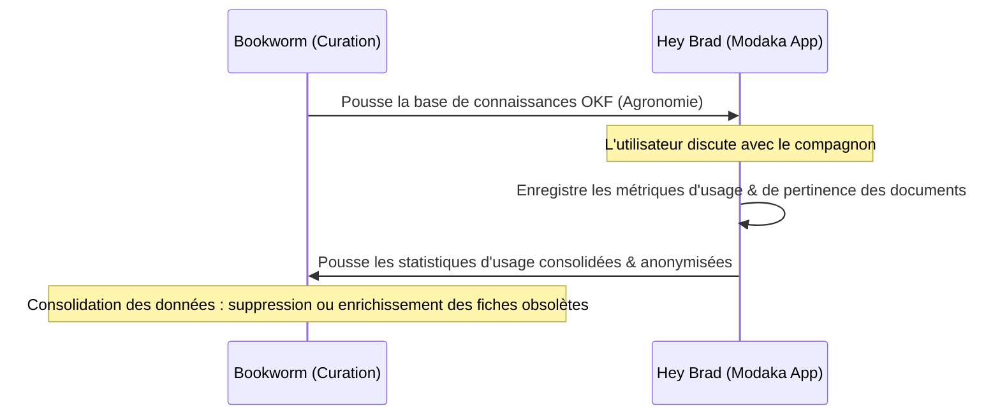

# Spécification Technique - Priorité 3 : Hey Brad & Boucle de Rétroaction

Cette dernière étape détaille l'implémentation de la déclinaison métier agricole **Hey Brad** et la mise en place d'une boucle fermée d'apprentissage sémantique bidirectionnelle pour optimiser la curation de contenus.

---

## 1. White-Label Agricole : `hey-brad`

**`hey-brad`** est la première application dérivée (white-label) construite sur la plateforme `modaka-saas`.

* **Métier spécifique** : Intégration de règles de logique métier agricole, de tables de calculs agronomiques et de prompts système calibrés pour répondre à des problématiques de terrain (gestion des sols, maladies, calendriers de récoltes).
* **Alimentation** : Consomme en continu l'arbre OKF d'agronomie mondiale généré par l'application de curation **Bookworm**.

---

## 2. Boucle de Rétroaction Bidirectionnelle (Hey Brad <-> Bookworm)

La communication entre l'application finale (Hey Brad) et la plateforme de curation (Bookworm) est bidirectionnelle afin d'assurer l'amélioration continue des données partagées.

### A. Collecte Locale des Métriques d'Usage (Socle Modaka)
À chaque interaction avec le compagnon IA, le moteur d'exécution local (`modaka`) enregistre silencieusement des métriques d'utilité sur les documents OKF chargés dans le contexte :
* **Fréquence d'utilisation** : Nombre de fois qu'une fiche agronomique spécifique a servi à construire une réponse de l'IA.
* **Score de pertinence implicite** : Déduit par analyse sémantique et sentimentale de la suite de la conversation (ex: si l'utilisateur dit *"ce n'est pas ce que je cherche"*, le document est noté négativement).
* **Signaux explicites** : Votes utilisateur (pouce haut/bas), corrections textuelles de la transcription ou suppression de la note locale.

### B. Priorisation et Filtrage Local
Le moteur conversationnel de l'application utilise ces scores en direct :
* **Promotion** : Les fiches OKF hautement pertinentes sur une thématique sont prioritaires lors de la recherche vectorielle ou par mots-clés.
* **Exclusion** : Les documents systématiquement ignorés ou marqués comme erronés par les utilisateurs locaux sont exclus des recherches afin d'économiser le contexte de l'IA et d'éviter les hallucinations.

### C. Télémétrie Anonymisée & Consolidation (Retour vers Bookworm)
Périodiquement, l'application mobile compile et anonymise ces données d'usage (toutes les conversations et identifiants utilisateurs sont supprimés pour ne garder que les ID des documents et leurs scores d'utilité globaux).
* **Poussée vers Bookworm** : Les statistiques consolidées sont envoyées à Bookworm.
* **Outil de curation** : Bookworm affiche ces indicateurs aux curateurs. Les experts identifient immédiatement :
  * Les fiches agronomiques les plus consultées et appréciées (à enrichir en priorité).
  * Les fiches qui ont provoqué des confusions ou des réponses insatisfaisantes (à corriger ou ré-indexer).
  * Les fiches obsolètes à supprimer globalement.
